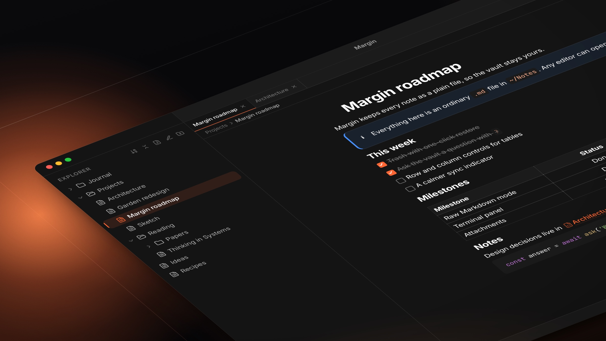
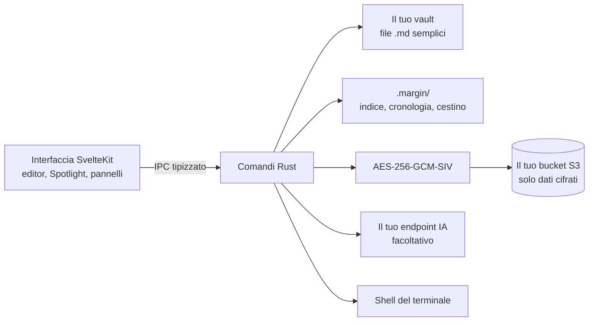

<br />
<p align="center">
    <h1>Margin</h1>
    <b>Un editor Markdown local-first. Le tue note sono semplici file .md in una cartella che scegli tu: le trovi all'istante, fai loro domande con la tua IA e le sincronizzi cifrate end-to-end su qualsiasi bucket S3.</b>
    <br />
    <br />
</p>

[English](README.md) | Italiano

Margin è un'app desktop per le note, pensata per chi vuole che le proprie note sopravvivano all'app. Ogni nota è un normale file Markdown in una cartella che scegli tu: leggibile da qualsiasi editor, ricercabile da qualsiasi strumento, e ancora tua il giorno in cui smetti di usare Margin.

Funziona su macOS, Windows e Linux, è scritta in Rust e Svelte su Tauri, e non ha account, server né telemetria. Tutto ciò che lascia il tuo computer per la sincronizzazione viene prima cifrato in Rust, con una chiave derivata da una passphrase di 12 parole che non lascia mai il tuo dispositivo.

Scarica l'ultima versione dalla [pagina delle release](https://github.com/lowsbarrel/margin/releases/latest).

Indice:

- [Funzionalità](#funzionalità)
- [Installazione](#installazione)
- [Primi passi](#primi-passi)
  - [Scorciatoie da tastiera](#scorciatoie-da-tastiera)
  - [Chiedi al vault](#chiedi-al-vault)
  - [Sincronizzazione](#sincronizzazione)
- [Compilare dai sorgenti](#compilare-dai-sorgenti)
- [Architettura](#architettura)
- [Contribuire](#contribuire)
- [Sicurezza](#sicurezza)
- [Licenza](#licenza)

## Funzionalità

- **File Markdown semplici** - Le note sono file `.md` in una cartella che scegli tu. Nessun database, nessun formato proprietario, nessun vincolo.

- **Editor completo** - Scrivi in un editor WYSIWYG con tabelle (aggiungi, sposta e allinea righe e colonne), liste di attività, callout, blocchi di codice, formule KaTeX, diagrammi Mermaid, `[[wiki link]]` e un menu dei blocchi con `/`.

- **Modalità Markdown grezzo** - Passa al testo sorgente esatto di qualsiasi nota con <kbd>Cmd/Ctrl</kbd>+<kbd>Shift</kbd>+<kbd>E</kbd>, modificato in CodeMirror con evidenziazione della sintassi.

- **Spotlight** - Una sola palette per tutto: nomi delle note, ricerca a testo pieno, `#tag` e sostituzione in tutto il vault.

- **Chiedi al vault** - Scrivi `?` in Spotlight per fare una domanda alle tue note. Margin le cerca, le legge e le cita tramite qualsiasi provider compatibile con OpenAI o con Anthropic, compresi i modelli locali, con un livello di ragionamento regolabile.

- **Terminale** - Apri shell reali nel tuo vault in un pannello in basso con le schede.

- **Cronologia e cestino** - Le versioni precedenti di ogni nota vengono conservate mentre lavori, con un confronto con il testo attuale, e i file eliminati restano 30 giorni nel cestino prima di sparire.

- **Allegati** - Incolla o trascina immagini e file: vengono salvati una sola volta, con un nome ricavato dal contenuto, tenuti fuori dall'albero dei file e spostati nel cestino dopo una settimana in cui nessuna nota li usa.

- **Visualizzatori** - Ingrandisci e sposta le immagini, leggi i PDF con testo selezionabile e ricerca, e apri tutto il resto con l'app predefinita.

- **Sincronizzazione cifrata** - Replica il vault su qualsiasi bucket compatibile con S3 (AWS S3, Cloudflare R2, Backblaze B2, MinIO). Il bucket conserva solo dati cifrati.

- **Area di lavoro** - Pannelli affiancati con schede, una tela per disegnare, backlink, esportazione in PDF e ZIP, temi chiaro e scuro, inglese e italiano, e aggiornamenti automatici.

## Installazione

Scegli il file per la tua piattaforma dall'[ultima release](https://github.com/lowsbarrel/margin/releases/latest):

|Piattaforma|File|
|---|---|
|**macOS** (Apple silicon)|`Margin_<versione>_aarch64.dmg`|
|**macOS** (Intel)|`Margin_<versione>_x64.dmg`|
|**Windows**|`Margin_<versione>_x64-setup.exe` oppure `Margin_<versione>_x64_en-US.msi`|
|**Linux**|`Margin_<versione>_amd64.AppImage` oppure `Margin_<versione>_amd64.deb`|

Una volta installato, Margin controlla da solo gli aggiornamenti firmati.

## Primi passi

Al primo avvio un breve tour, che puoi saltare, ti accompagna nella creazione di un vault:

1. **Scegli una cartella.** Qualsiasi cartella locale. I file `.md` che contiene diventano le tue note.
2. **Dai un nome al vault.** Puoi tenere più vault, ognuno con la sua cartella.
3. **Conserva la passphrase.** Margin genera 12 parole da cui deriva la chiave di cifratura del vault. Scrivile da qualche parte: non esiste un reset, e senza di esse il vault sincronizzato non si può leggere.

Poi inizia a scrivere. <kbd>Cmd/Ctrl</kbd>+<kbd>N</kbd> crea una nota, `/` apre il menu dei blocchi, `[[` collega un'altra nota e `:::info` inizia un callout.

### Scorciatoie da tastiera

`Mod` è <kbd>Cmd</kbd> su macOS e <kbd>Ctrl</kbd> su Windows e Linux.

|Scorciatoia|Azione|
|---|---|
|`Mod`+`K` oppure `Mod`+`P`|Apri Spotlight|
|`Mod`+`Shift`+`F`|Cerca in tutto il vault|
|`Mod`+`N`|Nuova nota|
|`Mod`+`\`|Mostra o nascondi la barra laterale|
|`Mod`+`` ` ``|Mostra o nascondi il terminale|
|`Mod`+`Shift`+`E`|Passa da testo formattato a Markdown grezzo e viceversa|
|`Mod`+`Shift`+`T`|Riapri l'ultima scheda chiusa|
|`Mod`+`F` / `Mod`+`H`|Trova / trova e sostituisci nella nota|
|`F2` oppure triplo clic|Rinomina il file o la cartella selezionati|

In Spotlight, inizia con `#` per sfogliare i tag e con `?` per fare una domanda.

### Chiedi al vault

Apri **Impostazioni → IA**, scegli il formato dell'API, imposta l'URL di base e la chiave, e carica l'elenco dei modelli:

|Provider|Formato API|URL di base|
|---|---|---|
|OpenAI|Compatibile OpenAI|`https://api.openai.com/v1`|
|OpenRouter|Compatibile OpenAI|`https://openrouter.ai/api/v1`|
|Ollama (locale)|Compatibile OpenAI|`http://localhost:11434/v1`|
|Anthropic|Compatibile Anthropic|`https://api.anthropic.com`|

Margin risponde a partire dalle tue note con strumenti di sola lettura (ricerca a testo pieno, ricerca con espressioni regolari, lettura delle note, tag e backlink) e cita le note che ha usato. Il livello di ragionamento scambia velocità con risposte più accurate sui modelli che lo supportano.

### Sincronizzazione

Apri **Impostazioni → Archiviazione S3** e inserisci endpoint, nome, regione e chiavi di accesso del bucket. Sincronizza dalla barra di stato, oppure attiva la sincronizzazione automatica ogni 5 minuti. Quando una nota è cambiata da entrambe le parti, per impostazione predefinita vince la versione locale e quella remota viene conservata accanto come file `.sync-conflict`.

## Compilare dai sorgenti

Servono Bun 1.3 o successivo, una toolchain Rust e i [prerequisiti di Tauri v2](https://v2.tauri.app/start/prerequisites/) per la tua piattaforma.

```bash
git clone https://github.com/lowsbarrel/margin.git
cd margin/app
bun install
bun run tauri dev
```

`bun run tauri build` produce un pacchetto di release per la piattaforma corrente. Prima di aprire una pull request, esegui i controlli da `app/`:

```bash
bun run lint
bun run check
bun run check:invariants
cd src-tauri && cargo clippy --all-targets -- -D warnings && cargo test
```

Vedi [AGENTS.md](AGENTS.md) per le convenzioni di sviluppo, strumenti e verifica.

## Architettura



Margin è un'app Tauri 2: un'interfaccia SvelteKit 5 che gira nella webview di sistema e un nucleo Rust che gestisce file system, cifratura, client S3, indice di ricerca, cronologia e terminale. Ogni chiamata dall'interfaccia passa da binding tipizzati generati a un comando Rust sottile che delega a un modulo.

Le note restano file su disco. I dati derivati (l'indice a testo pieno SQLite, la cronologia delle note e il cestino) stanno nella cartella nascosta `.margin/` del vault e non lasciano mai il computer. Maggiori dettagli in [AGENTS.md](AGENTS.md).

## Contribuire

I contributi sono benvenuti. Lavora su un branch a partire da `main` e apri una pull request: la CI controlla formattazione, lint, tipi e test su macOS, Windows e Linux, e i titoli seguono [Conventional Commits](https://www.conventionalcommits.org/). [AGENTS.md](AGENTS.md) descrive come è organizzato il codice e cosa significa "finito".

## Sicurezza

- La chiave del vault viene derivata sul tuo dispositivo da una passphrase BIP-39 di 12 parole; non ci sono account né server.
- La sincronizzazione cifra ogni file in Rust con AES-256-GCM-SIV prima del caricamento, quindi il bucket conserva solo dati cifrati.
- La cartella `.margin/` (indice, cronologia, cestino, impostazioni cifrate) non viene mai caricata.
- L'unico punto in cui il testo delle note lascia il computer in chiaro è l'endpoint IA che configuri tu, e solo per le domande che fai.

Segnala le vulnerabilità in privato tramite un [avviso di sicurezza su GitHub](https://github.com/lowsbarrel/margin/security/advisories/new) invece che con una issue pubblica.

## Licenza

Questo repository è distribuito con [licenza MIT](LICENSE).
