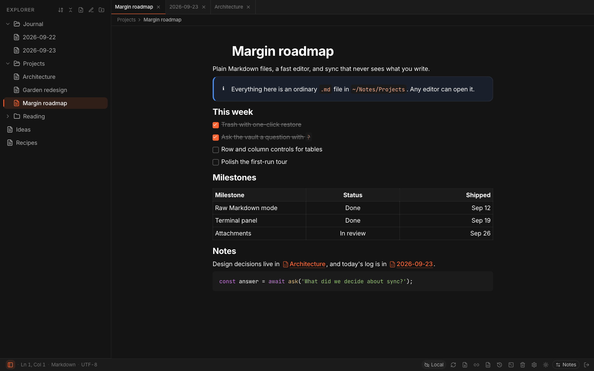
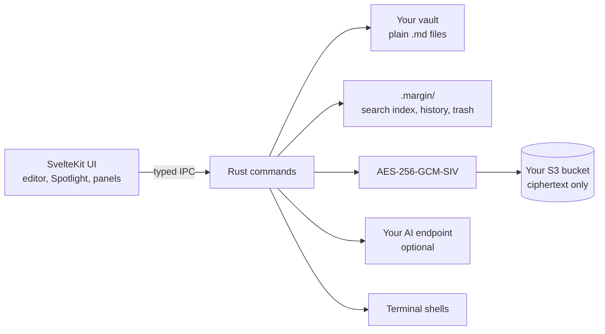

<br />
<p align="center">
    <h1>Margin</h1>
    <b>A local-first Markdown editor. Your notes are plain .md files in a folder you choose; search them instantly, ask them questions with your own AI, and sync them end-to-end encrypted to any S3 bucket.</b>
    <br />
    <br />
</p>

[](https://github.com/lowsbarrel/margin/releases/latest)
[](https://github.com/lowsbarrel/margin/actions/workflows/ci.yml)
[](LICENSE)

English | [Italiano](README-IT.md)

Margin is a desktop note app for people who want their notes to outlive the app. Every note is an ordinary Markdown file in a directory you pick: readable by any editor, greppable by any tool, and still yours the day you stop using Margin.

It runs on macOS, Windows and Linux, is written in Rust and Svelte on top of Tauri, and has no account, no server and no telemetry. Anything that leaves your machine for sync is encrypted in Rust first, under a key derived from a 12-word passphrase that never leaves your device.

Download the latest version from the [releases page](https://github.com/lowsbarrel/margin/releases/latest).

Table of Contents:

- [Features](#features)
- [Installation](#installation)
- [Getting Started](#getting-started)
  - [Keyboard shortcuts](#keyboard-shortcuts)
  - [Ask your vault](#ask-your-vault)
  - [Sync](#sync)
- [Building from Source](#building-from-source)
- [Architecture](#architecture)
- [Contributing](#contributing)
- [Security](#security)
- [License](#license)

## Features

- **Plain Markdown files** - Notes live as `.md` files in a folder you choose. No database, no proprietary format, no lock-in.

- **Rich editor** - Write in a WYSIWYG editor with tables (add, move and align rows and columns), task lists, callouts, code blocks, KaTeX math, Mermaid diagrams, `[[wiki links]]` and a `/` block menu.

- **Raw Markdown mode** - Switch any note to its exact source text with <kbd>Cmd/Ctrl</kbd>+<kbd>Shift</kbd>+<kbd>E</kbd>, edited in CodeMirror with syntax highlighting.

- **Spotlight** - One palette for everything: note names, full-text search, `#tags`, and replace across the vault.

- **Ask your vault** - Type `?` in Spotlight to ask your notes a question. Margin searches, reads and cites them through any OpenAI-compatible or Anthropic-compatible provider, including local models, with an adjustable reasoning effort.

- **Terminal** - Open real shells in your vault in a bottom panel with tabs.

- **History and trash** - Earlier versions of every note are kept as you work, with a diff against the current text, and deleted files wait 30 days in the trash before they are gone.

- **Attachments** - Paste or drop images and files: they are stored once, named by their content, kept out of the file tree, and moved to the trash after a week without any note using them.

- **Viewers** - Zoom and pan images, read PDFs with selectable text and search, and open anything else in its default app.

- **Encrypted sync** - Mirror the vault to any S3-compatible bucket (AWS S3, Cloudflare R2, Backblaze B2, MinIO). The bucket only ever stores ciphertext.

- **Workspace** - Split panes with tabs, a drawing canvas, backlinks, PDF and ZIP export, light and dark themes, English and Italian, and automatic updates.

## Installation

Pick the file for your platform from the [latest release](https://github.com/lowsbarrel/margin/releases/latest):

|Platform|File|
|---|---|
|**macOS** (Apple silicon)|`Margin_<version>_aarch64.dmg`|
|**macOS** (Intel)|`Margin_<version>_x64.dmg`|
|**Windows**|`Margin_<version>_x64-setup.exe` or `Margin_<version>_x64_en-US.msi`|
|**Linux**|`Margin_<version>_amd64.AppImage` or `Margin_<version>_amd64.deb`|

Margin checks for signed updates on its own once it is installed.

## Getting Started

The first launch walks you through a short tour, which you can skip, and then creates a vault:

1. **Pick a folder.** Any local directory. Existing `.md` files in it become your notes.
2. **Name the vault.** Several vaults can live side by side, each with its own folder.
3. **Save the passphrase.** Margin generates 12 words that derive your vault's encryption key. Write them down: there is no reset, and without them your synced vault cannot be read.

Then start writing. <kbd>Cmd/Ctrl</kbd>+<kbd>N</kbd> creates a note, `/` opens the block menu, `[[` links another note, and `:::info` starts a callout.

### Keyboard shortcuts

`Mod` is <kbd>Cmd</kbd> on macOS and <kbd>Ctrl</kbd> on Windows and Linux.

|Shortcut|Action|
|---|---|
|`Mod`+`K` or `Mod`+`P`|Open Spotlight|
|`Mod`+`Shift`+`F`|Search the whole vault|
|`Mod`+`N`|New note|
|`Mod`+`\`|Show or hide the sidebar|
|`Mod`+`` ` ``|Show or hide the terminal|
|`Mod`+`Shift`+`E`|Switch between rich text and raw Markdown|
|`Mod`+`Shift`+`T`|Reopen the last closed tab|
|`Mod`+`F` / `Mod`+`H`|Find / find and replace in the note|
|`F2` or triple-click|Rename the selected file or folder|

In Spotlight, start with `#` to browse tags and with `?` to ask a question.

### Ask your vault

Open **Settings → AI**, choose the API format, set the base URL and key, and load the model list:

|Provider|API format|Base URL|
|---|---|---|
|OpenAI|OpenAI-compatible|`https://api.openai.com/v1`|
|OpenRouter|OpenAI-compatible|`https://openrouter.ai/api/v1`|
|Ollama (local)|OpenAI-compatible|`http://localhost:11434/v1`|
|Anthropic|Anthropic-compatible|`https://api.anthropic.com`|

Margin answers from your notes with read-only tools (full-text search, regex search, reading notes, tags and backlinks) and cites the notes it used. The effort setting trades speed for more thorough answers on models that support reasoning.

### Sync

Open **Settings → S3 Storage** and enter your bucket's endpoint, name, region and access keys. Sync from the status bar, or turn on automatic sync every 5 minutes. When both sides changed a note, the local version wins by default and the remote one is kept next to it as a `.sync-conflict` file.

## Building from Source

Building requires Bun 1.3 or later, a Rust toolchain and the [Tauri v2 prerequisites](https://v2.tauri.app/start/prerequisites/) for your platform.

```bash
git clone https://github.com/lowsbarrel/margin.git
cd margin/app
bun install
bun run tauri dev
```

`bun run tauri build` produces a release bundle for the current platform. Before opening a pull request, run the checks from `app/`:

```bash
bun run lint
bun run check
bun run check:invariants
cd src-tauri && cargo clippy --all-targets -- -D warnings && cargo test
```

See [AGENTS.md](AGENTS.md) for engineering, tooling and verification conventions.

## Architecture



Margin is a Tauri 2 app: a SvelteKit 5 interface running in the system webview, and a Rust core that owns the filesystem, encryption, the S3 client, the search index, history and the terminal. Every call from the interface goes through generated, typed bindings to a thin Rust command that delegates to a module.

Your notes stay as files on disk. Derived data (the SQLite full-text index, note history and the trash) lives in the vault's hidden `.margin/` folder and never leaves the machine. More detail is in [AGENTS.md](AGENTS.md).

## Contributing

Contributions are welcome. Work on a branch off `main` and open a pull request: CI checks formatting, lints, types and tests on macOS, Windows and Linux, and titles follow [Conventional Commits](https://www.conventionalcommits.org/). [AGENTS.md](AGENTS.md) describes how the code is organised and what "done" means.

## Security

- The vault key is derived on your device from a 12-word BIP-39 passphrase; there are no accounts and no server.
- Sync encrypts every file in Rust with AES-256-GCM-SIV before upload, so the bucket only stores ciphertext.
- The `.margin/` folder (index, history, trash, encrypted settings) is never uploaded.
- The only place note text leaves your machine unencrypted is the AI endpoint you configure, and only for the questions you ask.

Please report vulnerabilities privately through a [GitHub security advisory](https://github.com/lowsbarrel/margin/security/advisories/new) rather than a public issue.

## License

This repository is available under the [MIT License](LICENSE).
